# DBDOME Dashboard Guide

**Product:** DBDOME Database Security and Monitoring Platform
**Applies to:** DBDOME 2.02.x — Grafana OSS 12.2.0
**Document version:** 1.0
**Date:** 2026-08-23
**Audience:** Security analysts, DBAs, platform administrators
**Coverage:** All 102 dashboards

---

## 1. How to use this guide

DBDOME ships up to 102 Grafana dashboards. This guide explains what each one
shows, who it is for, and when to open it.

**Two dashboard sets exist, and which you have depends on your install.** A base
install carries 73 dashboards in four folders. A full install adds 29 more,
including the entire 14-dashboard **GRC** folder covering risk, compliance,
incidents, attestation and cross-border transfer tracking.

Sections 4–10 cover the 73 dashboards common to every install. **Section 11
covers the GRC folder** and **Section 12 the remaining additions**. If a
dashboard described there is absent from your system, you are on a base install
and the GRC capability was not provisioned — that is a deployment difference, not
a fault.

Dashboards fall into four functional classes. Knowing which class you are looking
at tells you how to read it:

| Class | Purpose | How to read it |
|---|---|---|
| **Program** | Numbered 1–7. One security capability each, top to bottom | Start here for coverage and posture |
| **Operational** | Live alert and incident work | Daily analyst use |
| **Thematic** | One finding type in depth | Open from an alert, not cold |
| **Configuration / Action** | Change platform behaviour | Administrators; several **write** to the system |

> **Action dashboards can change your databases.** RBAC, Dynamic Data Masking,
> Static Data Masking, Anonymization, Tokenization, Take Action, Blocker Activity
> and Webhook Alerts Configuration all contain controls that act on monitored
> systems. They are covered in Section 8, which you should read before using
> them.

---

## 2. Conventions shared by all dashboards

### 2.1 Template variables

| Variable | Meaning |
|---|---|
| `global_ip` | DBDOME host address. Builds links and API calls. If dashboards render empty across the board, this is the first thing to check — it derives from `ORG_IP` in `.env` |
| `dbdome_version` | Build identifier, shown for support |
| `server`, `database`, `schema`, `table`, `column` | Cascading drill-down selectors |
| `root_cause_id` | Selected root cause; drives the detail panels |
| `alert_id` | Selected alert; drives the verdict and value panels |
| `risk_level` | Severity filter |

Selectors cascade: choosing a server repopulates databases, which repopulates
tables, and so on. Changing a selector high in the chain resets those below it.

### 2.2 Navigation panels

Most dashboards carry two text panels:

* **`dbdome - Dashboards`** — links to related dashboards
* **`dbdome - GRC`** — links to governance, risk and compliance views

These are navigation, not data. Several dashboards also use **library panels**,
which are shared definitions — editing one changes it everywhere it appears.

### 2.3 Time range

Grafana's time picker applies throughout. Several panels state their own window
in the title (for example *Alerts Sent (7d)*); those ignore the picker. When a
panel's figures disagree with your expectation, check the title for a fixed
window before assuming a data problem.

---

## 3. Where to start

| You want to… | Open |
|---|---|
| See what needs attention now | **Open Alerts** |
| Work a specific alert end to end | **Alerts** |
| Show posture to management or an auditor | **Program dashboards 1–7** |
| Check the platform is configured correctly | **Configuration** (`dbdome-configuration`) |
| Find where sensitive data lives | **Sensitive Columns Explorer** |
| Investigate a suspected injection | **SQL injection board**, then the specific type |
| Confirm collection is healthy | **7. Automation & Workflows** |

---

## 4. Folder: `dbexpert.ai`

### 4.1 main  · `ad65k5x` · 2 panels
The landing dashboard. Currently a text panel and one time series titled *New
panel* — it is effectively a placeholder rather than a working home page.

> Consider making this a real landing page or removing it; a first-run user who
> lands here sees nothing meaningful about their estate.

---

## 5. Folder: `Configuration`

### 5.1 Configuration · `dbdome-configuration` · 33 panels

<!-- shot -->
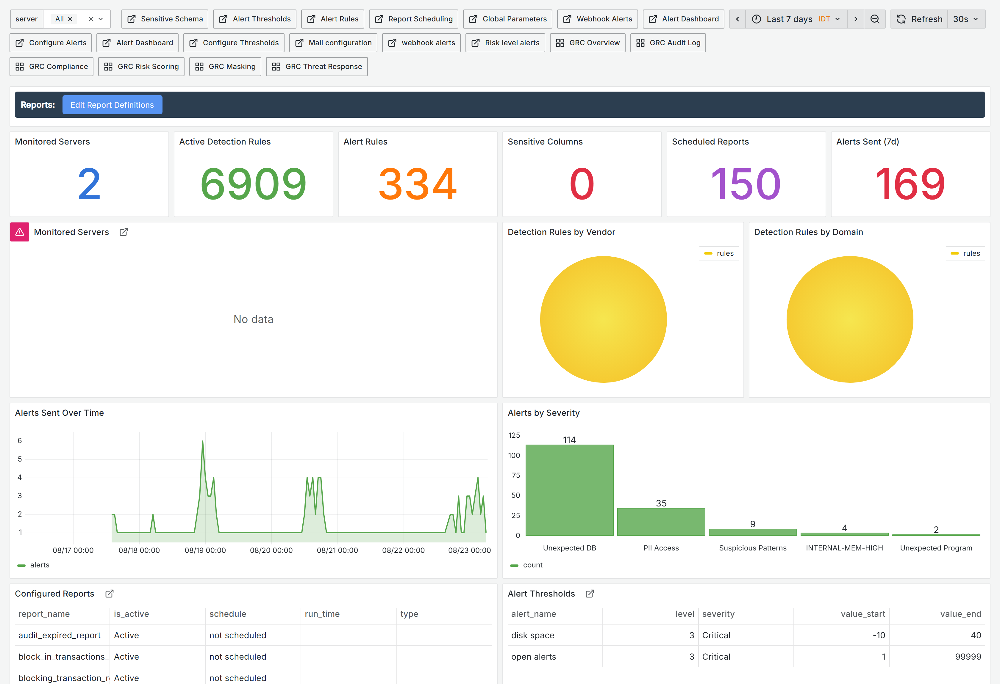

**The platform's own control panel, and the most complete inventory view.**

Top row of stats: *Monitored Servers*, *Active Detection Rules*, *Alert Rules*,
*Sensitive Columns*, *Scheduled Reports*, *Alerts Sent (7d)*. Beneath: detection
rules broken down **by vendor** and **by domain**, alerts over time, alerts by
severity, and the configured-reports table.

**Use it to** confirm the platform is set up as intended and answer "what are we
actually covering?".

**Read the two rule breakdowns together.** Rules by vendor shows whether every
database platform you run is genuinely covered; rules by domain shows whether
coverage is lopsided toward one security area. A high total rule count can still
hide a vendor with almost no rules.

---

## 6. Folder: `Security dashboard` — Program dashboards 1–7

These seven present the security programme as a whole. They are the right
dashboards for reporting and review, and the wrong ones for working an individual
alert.

### 6.1 1. Data Discovery & Classification · `addpcfp` · 28 panels

<!-- shot -->
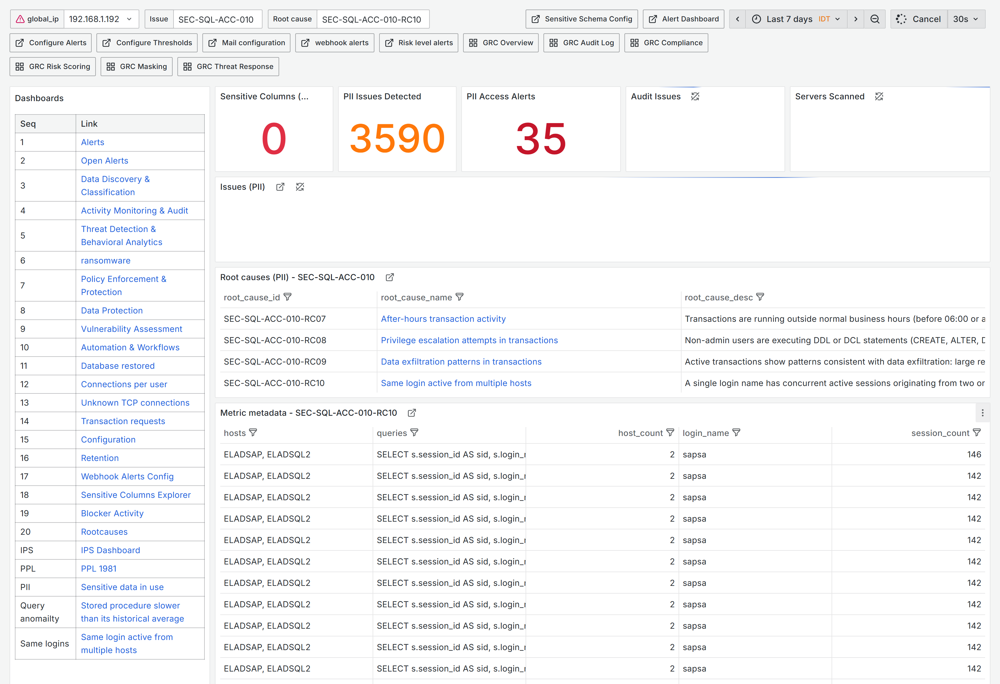

Where sensitive data lives: discovered PII, classification results, and coverage
of the classification process. The foundation for every other control — you
cannot protect what you have not found.

At 28 panels it is the second-largest dashboard in the product, behind only
3. Threat Detection.

### 6.2 2. Activity Monitoring & Audit · `adbcsrw` · 13 panels

<!-- shot -->
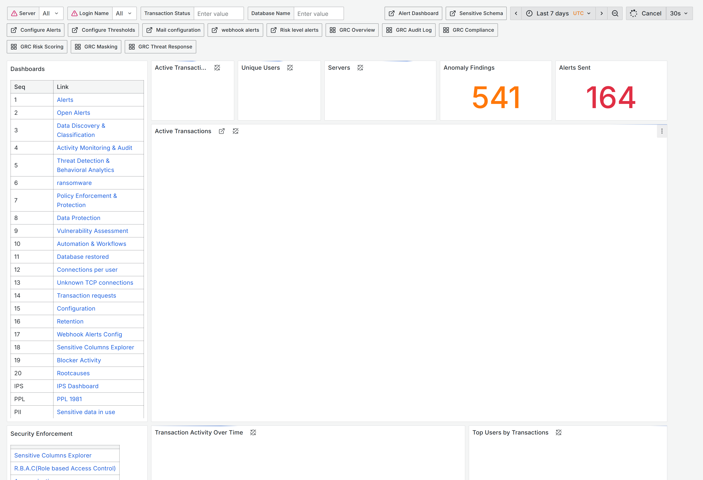

Who is doing what. Stats for *Active Transactions*, *Unique Users*, *Servers*,
*Anomaly Findings*, *Alerts Sent*; then transaction activity over time and top
users by transaction volume.

Filters by `server`, `login_name`, `transaction_status`, `database_name`.

**Use it to** establish what normal looks like. *Top Users by Transactions* is
the fastest way to spot an account behaving unlike its peers.

### 6.3 2. Schema DML Tracking · `adf9njw` · 14 panels

<!-- shot -->
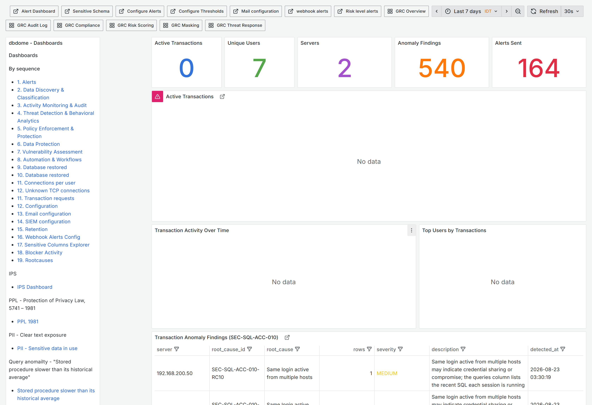

Structural change tracking — who is altering schema, and DML against sensitive
objects. Carries *Transaction Anomaly Findings (SEC-SQL-ACC-010)* and a sensitive
data transaction view.

Note this shares the number "2" with the dashboard above. They are distinct:
6.2 covers activity, this covers schema change.

### 6.4 3. Threat Detection & Behavioral Analytics · `adccmtx` · 22 panels

<!-- shot -->
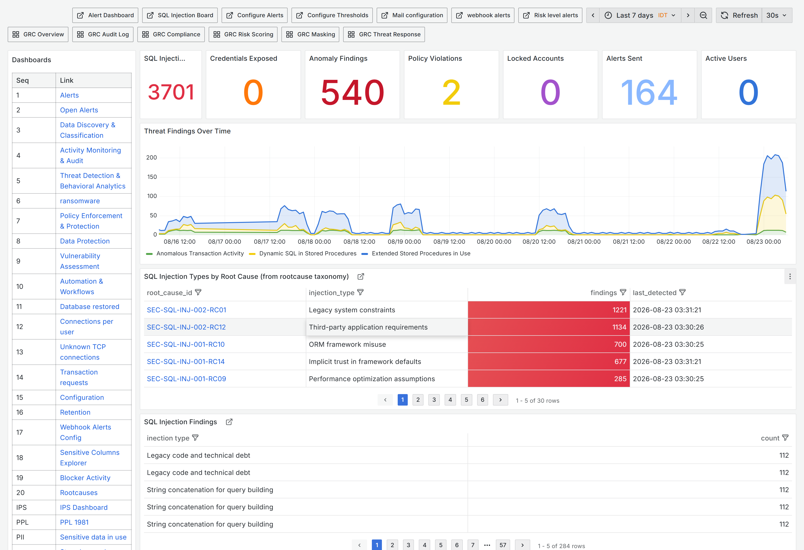

**The largest and most important detection dashboard.** Stats for *SQL
Injections*, *Credentials Exposed*, *Anomaly Findings*, *Policy Violations*,
*Locked Accounts*, *Alerts Sent*, *Active Users*, then findings over time,
*SQL Injection Types by Root Cause* drawn from the root-cause taxonomy, and the
detailed injection findings table.

**Use it as** the daily threat overview. The root-cause breakdown tells you not
just that injection attempts occurred but which techniques — which is what
determines the response.

### 6.5 4. Policy Enforcement & Protection · `adln6n5` · 11 panels

<!-- shot -->
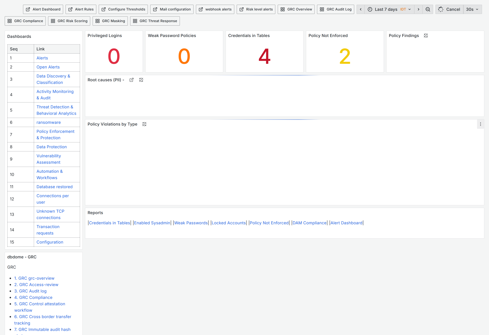

Where policy is defined but not honoured: *Privileged Logins*, *Weak Password
Policies*, *Credentials in Tables*, *Policy Not Enforced*, with violations by
type and a root-cause drill-down.

**Use it for** the gap between written policy and configured reality. These
findings are usually remediation work, not incidents.

### 6.6 5. Data Protection · `ad88jgn` · 13 panels

<!-- shot -->
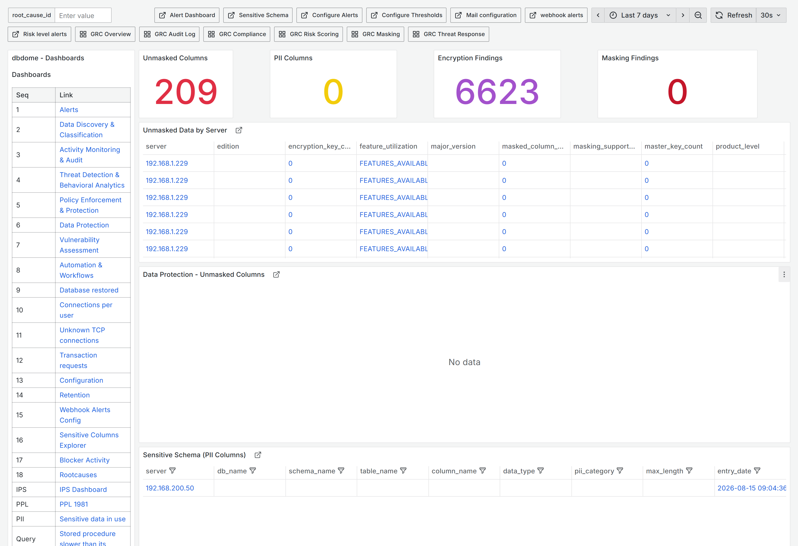

Masking and encryption coverage: *Unmasked Columns*, *PII Columns*, *Encryption
Findings*, *Masking Findings*, unmasked data by server, and the sensitive schema
listing. Drills down through `detail_server` / `detail_table` / `detail_column`.

**Read *Unmasked Columns* against *PII Columns*.** That ratio is your protection
coverage, and it is the number worth tracking over time.

### 6.7 6. Vulnerability Assessment · `adwb879` · 12 panels

<!-- shot -->
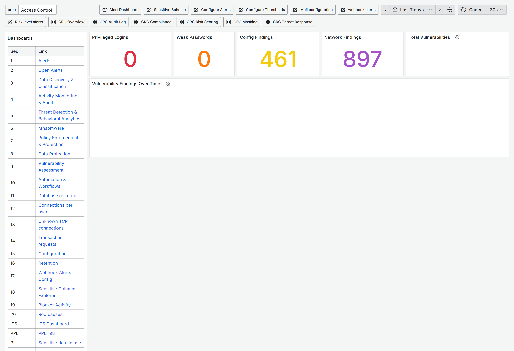

Configuration weakness rather than active attack: *Privileged Logins*, *Weak
Passwords*, *Config Findings*, *Network Findings*, *Total Vulnerabilities*, with
trend over time and a breakdown by security area (`area` variable).

**Use it for** the hardening backlog. The trend line is the useful part — the
absolute count means little without direction.

### 6.8 7. Automation & Workflows · `adsddxs` · 19 panels

<!-- shot -->
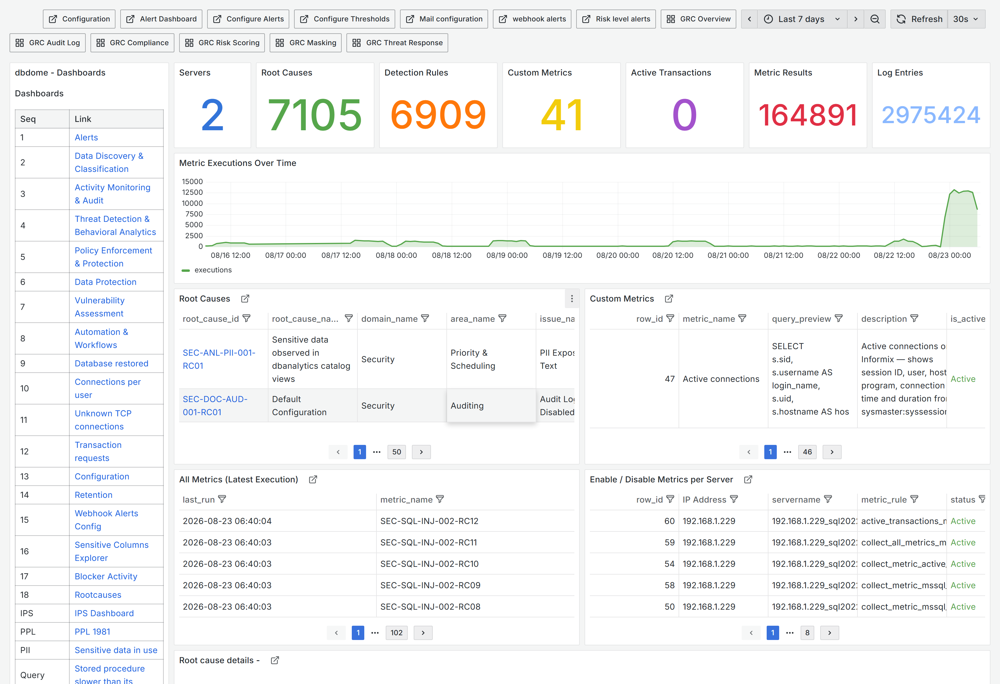

The platform's own operational health: *Servers*, *Root Causes*, *Detection
Rules*, *Custom Metrics*, *Active Transactions*, *Metric Results*, *Log Entries*,
executions over time, and **Enable / Disable Metrics per Server**.

**This is the dashboard that tells you monitoring is actually working.** *Metric
Executions Over Time* should be steady. A dip means collection stopped, and every
other dashboard becomes misleading — they will show few findings, which looks
like good news and is not.

> Contains controls that enable and disable metrics per server. Disabling a
> metric silently removes detection coverage. Treat changes here as change-
> controlled.

---

## 7. Folder: `Security dashboard` — Operational

### 7.1 Alerts · `ad7kkx7` · 17 panels

<!-- shot -->
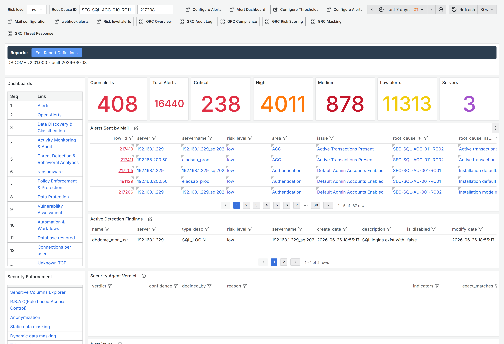

**The primary alert-working dashboard.** Stats for *Open alerts*, *Total Alerts*,
*Critical*, *High*, *Medium*, *Low*, *Servers*, *Alerts Sent by Mail*; then
*Active Detection Findings*, and two panels for the selected `alert_id`:

* **Security Agent Verdict** — the AI agent's assessment and its stated reason
* **Alert Value** — the underlying data that tripped the rule, as a table

**Workflow:** pick a `risk_level`, choose an alert, read *Alert Value* for the
facts, then read *Security Agent Verdict* for the hypothesis.

> **Read the value before the verdict.** The verdict is generated by a language
> model. It is a starting point, not a finding — it produces false positives and
> false negatives, and its reasoning can be fluent and wrong. Confirm against
> *Alert Value* and the database itself before acting. An empty verdict panel
> means the agent was disabled, had no model, or timed out; the alert is still
> valid.

### 7.2 Open Alerts · `advb58n` · 14 panels

<!-- shot -->
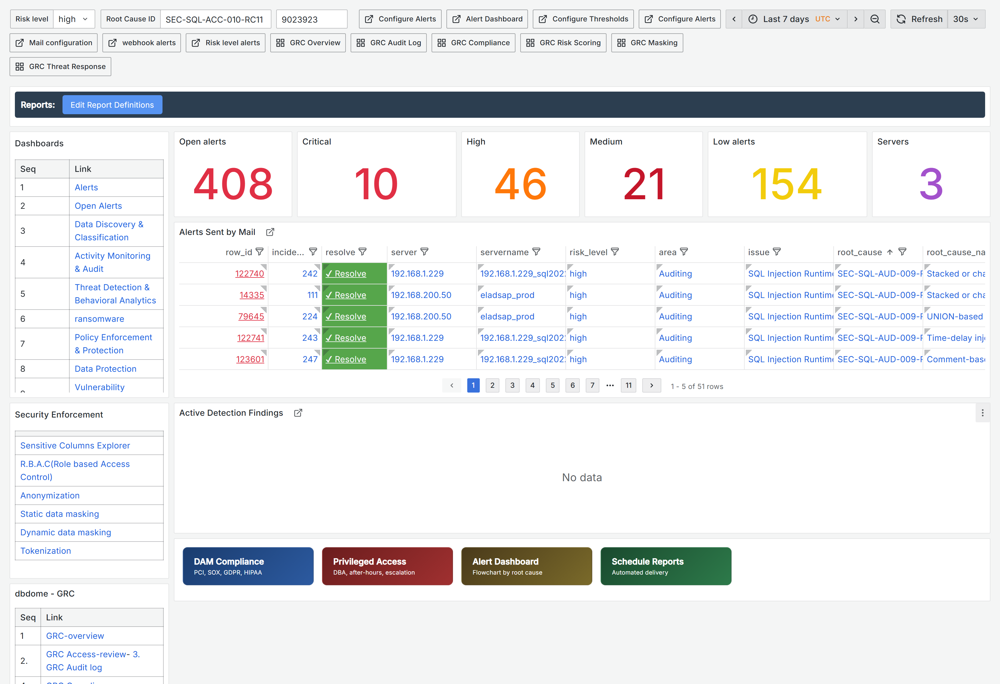

The unresolved queue: *Open alerts*, severity counts, *Servers*, *Alerts Sent by
Mail*, *Active Detection Findings*. Includes the incident **resolve** control.

**Use it as** the shift's work queue. Resolving requires a resolution type — it
must match the configured set or the form rejects it.

### 7.3 risk level alerts · `ad54967` · 7 panels
Alerts grouped by risk level, with *Risk Level Actions* and the *Risk Levels*
reference. Use it to check severity assignment is sensible — if nearly everything
is Critical, severity has stopped carrying information.

### 7.4 Rootcauses · `rootcauses` · 5 panels

<!-- shot -->
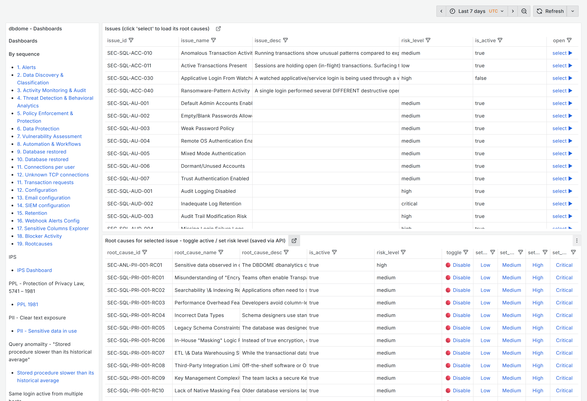

The root-cause catalogue. Select an issue to load its root causes, then **toggle
active state and set risk level**, saved through the API.

**This is where detection coverage is actually controlled.** Deactivating a root
cause stops that detection. Changes here are changes to a security control and
belong under change management.

### 7.5 Take Action · `ad2w7wd` · 15 panels

<!-- shot -->
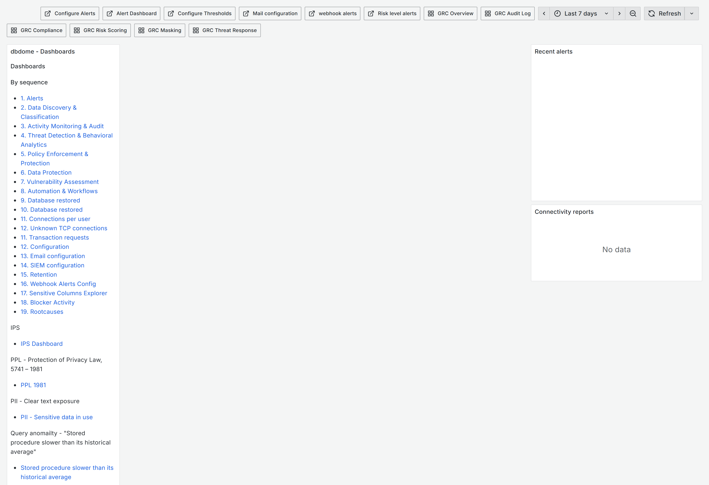

Response console: *Critical issues - SQL injection*, *Active threats*, *Active
users*, a **Take action** control, plus recent alerts and supporting reports.

> Initiates response actions against monitored systems. Confirm the target and
> the blast radius before use. See SOP Section 8.

### 7.6 Processes · `advf7vg` · 11 panels

<!-- shot -->

Scheduler process view — which background processes exist and how they are
running.

> A process can be registered and marked active yet never execute, if the build
> does not map its name to a function. The symptom is silence, not an error. If a
> feature is enabled and producing nothing, check the service log for *Unknown
> process name*.

---

## 8. Folder: `Security dashboard` — Configuration and action

> Everything in this section **writes**. Read SOP Section 8 first.

### 8.1 Configuration · `adnz9dq` · 19 panels
Server-centric configuration: *Servers*, *Detection Rules*, *Alert Rules*, *PII
Columns*, *Reports*, *Alerts (7d)*, *Params*, *Configuration Tools*, and per-
server detail including **Server Log - ${servername}**, filtered by `servername`.

The per-server log is the fastest way to diagnose one server that has stopped
reporting.

> There are **two** dashboards named *Configuration* — this one and
> `dbdome-configuration` (Section 5.1). This one is server-centric; that one is
> estate-wide. The identical name is a genuine usability problem; see Appendix B.

### 8.2 RBAC - Role Based Access Control · `secact-rbac` · 13 panels

<!-- shot -->
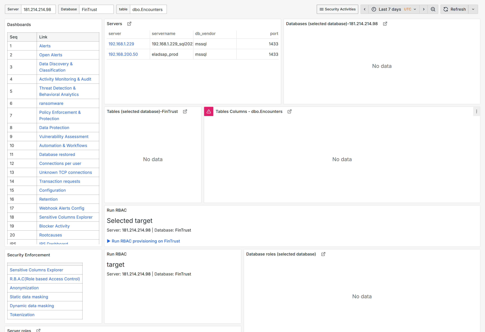

Access-rights explorer: server → database → table → columns, plus *Database
roles*, *Server roles*, *Users*, *Logins*, and a **Run RBAC** control.

**Use it to** answer "who can reach this table?" during an access review.

### 8.3 Dynamic Data Masking · `secact-ddm` · 12 panels

<!-- shot -->
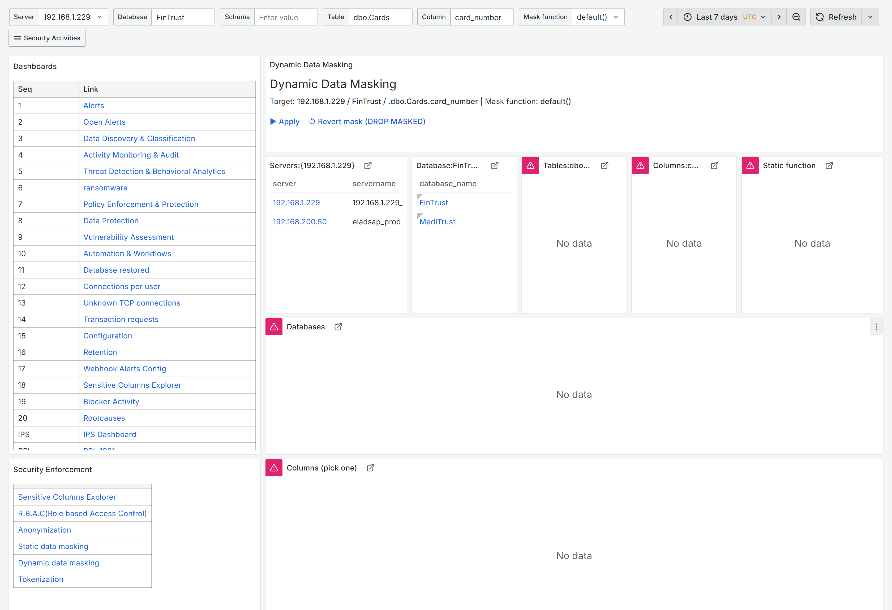

Selects server → database → table → column, applies a masking function, and shows
*Recent actions (audit)*. Masking is applied at query time.

### 8.4 Static Data Masking · `secact-static` · 12 panels
Same selection flow with **Before** and **After** previews.

> Static masking **modifies stored data**. It is not reversible. Confirm backups
> before applying, and preview every time.

### 8.5 Anonymization · `secact-anon` · 12 panels
Anonymization with *Before* / *Anonymization Preview* / *After* panels and an
audit trail. Properly applied anonymization is irreversible by design — that is
the point, and the risk.

### 8.6 Tokenization · `secact-token` · 13 panels
Replaces values with tokens, with a selectable encryption type, before/after
previews and an audit trail. Unlike anonymization, tokenization is reversible
with the key — so the key becomes as sensitive as the data.

### 8.7 Sensitive Columns Explorer · `adpiicol` · 15 panels

<!-- shot -->
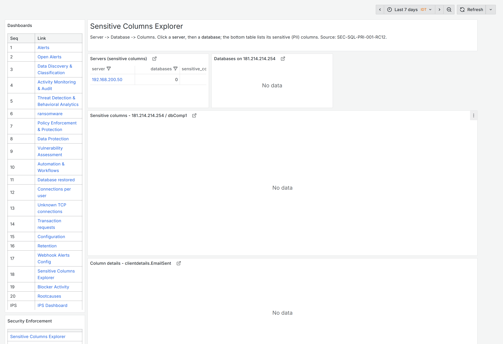

Server → database → sensitive columns → column detail, plus tracked columns from
`metrics.sensitive_columns`, masking activity from `metrics.masking_log`, and a
masked-data preview.

**The best single view for data protection work** — it connects what is sensitive
to what is actually protected.

### 8.8 Webhook Alerts Configuration · `adwhcfg1` · 7 panels

<!-- shot -->
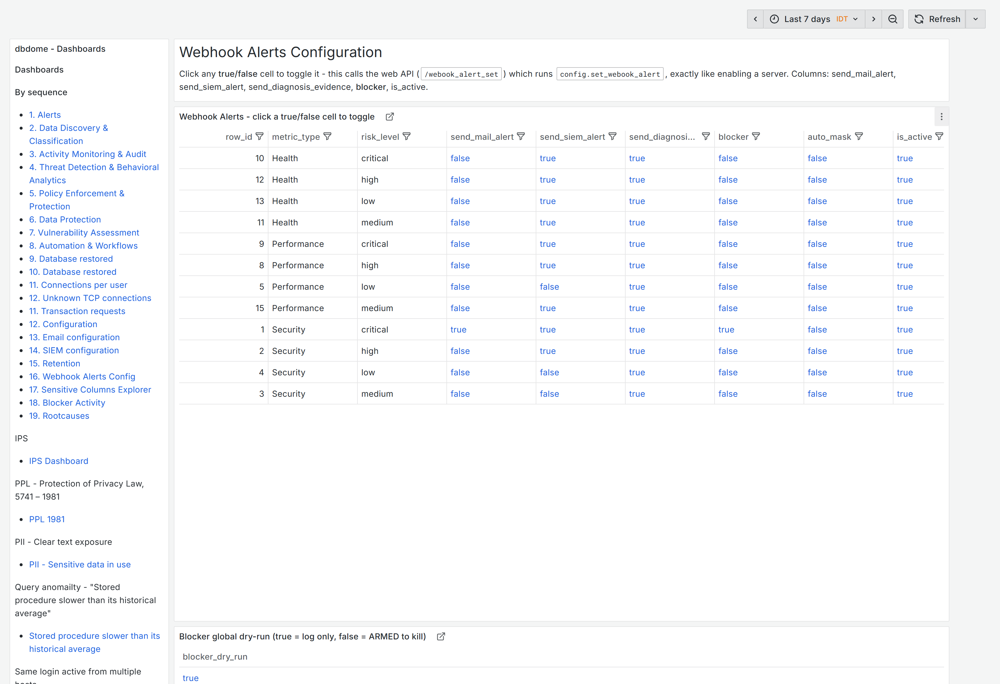

Toggle webhook alerts, and two global safety switches:

* **Blocker global dry-run** — `true` = log only; `false` = **ARMED to kill sessions**
* **Masking global dry-run** — `true` = log only; `false` = **ARMED to apply masks**

> These two toggles are the highest-consequence controls in the product. Setting
> either to `false` arms live enforcement against production databases. Require
> documented approval, a tested rollback and notified application owners. Verify
> the state here whenever enforcement behaviour is unexpected.

### 8.9 Blocker Activity · `adblkact` · 11 panels
What the blocker did: *Killed*, *Dry-run*, *Skipped*, *Errors*, current *Dry-run
mode*, the blocker log and executed blocks from `alerts.blocks`.

**Review weekly whenever the blocker is armed.** Every *Killed* entry terminated
a real session. Confirm each was correct.

### 8.10 Retention · `adretn001` · 11 panels
Retention overview, dump location, dump metrics, dumps catalog, apply/restore
controls.

> Retention governs deletion. Data aged out is gone. Confirm the policy matches
> your legal retention obligation, and preserve anything under legal hold before
> it ages out.

### 8.11 Retention policy · `adc222t` · 10 panels
The policy view alongside sensitivity, injection, activity and connectivity
reports.

### 8.12 Email configuration · `adcdjsj` · 7 panels
Mail groups, recipients and configuration actions. Verify recipients after any
change — misdirected alerts are a disclosure risk as well as a delivery failure.

### 8.13 Mail · `adxfxgr` · 4 panels
Mail configuration summary. Overlaps 8.12.

### 8.14 SIEM configuration · `adgtwcf` · 9 panels
SIEM forwarding configuration, with supporting report panels. Service names take
the form `format:transport` (for example CEF over TCP).

### 8.15 webhook alerts · `ad9mll4` · 5 panels
Webhook alert log — what was sent. Distinct from 8.8, which configures.

### 8.16 Custom metrics · `ad7c5hm` · 16 panels
Custom metric inventory: totals, active/inactive, results, matched findings, by
vendor and type, top executed, configuration, results with comparison, executions
over time.

**Use it after** adding a custom metric to confirm it executes and matches.

### 8.17 Send report by mail · `ad9p6d2` (folder `config`) · 8 panels
Report dispatch, with dashboard and GRC report catalogues. Scheduled SQL reports
must be parameter-free and are delivered as PDF and CSV.

---

## 9. Folder: `Security dashboard` — Thematic finding dashboards

Each covers one finding type. Open them **from an alert**, not cold. Most share a
layout: a stat row, a findings table, a root-cause table, and supporting reports.

### 9.1 Privileged access and accounts

| Dashboard | UID | What it shows |
|---|---|---|
| **Super users (sysadmin / sysDBA)** | `adbzzdg` | Accounts holding the highest privilege. Should be a short, fully justified list — review every entry |
| **Enabled sysadmin** | `adnskjz` | Accounts *newly* granted sysadmin. Privilege escalation is one of the strongest breach indicators |
| **sysadmin accounts with weak password enforcement** | `admz7fh` | Highest privilege combined with weakest authentication. Treat as urgent remediation |
| **Locked accounts** | `ad8pvv6` | Lockouts — brute force, or an application with stale credentials |

### 9.2 Credential exposure

| Dashboard | UID | What it shows |
|---|---|---|
| **Credentials stored in tables** | `adsxwnr` | Credentials found *inside* database tables, by server and table. A direct finding requiring removal, not tuning |
| **Linked servers / DBLINKS - Hidden credentials** | `adnb64w` | Credentials embedded in cross-database link definitions — an often-forgotten lateral-movement path |

### 9.3 Access patterns

<!-- shot -->
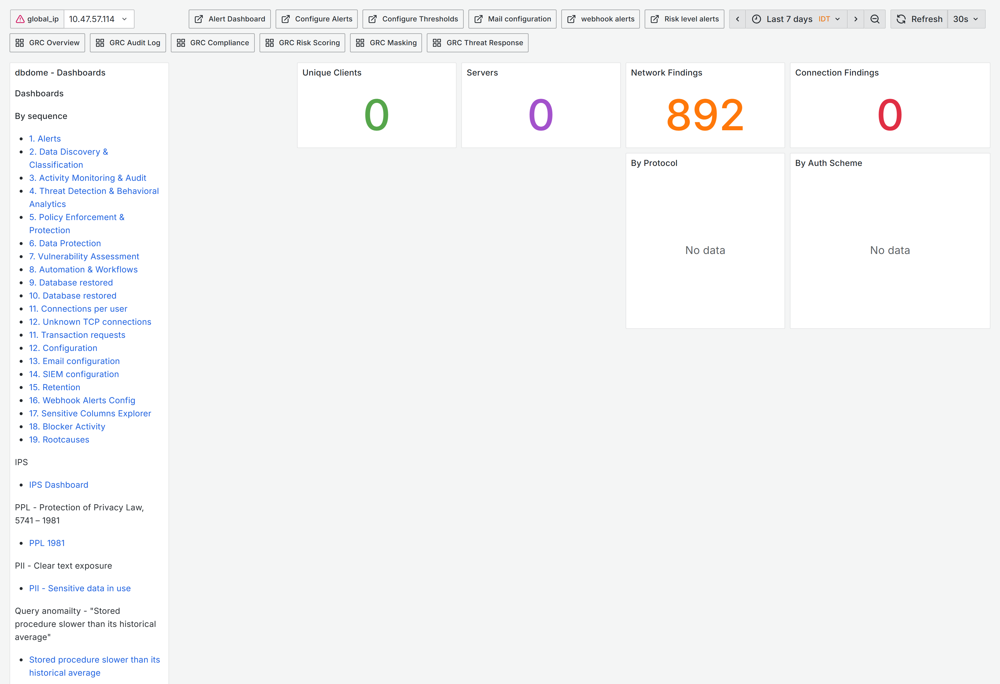

| Dashboard | UID | What it shows |
|---|---|---|
| **Same login active from multiple hosts** | `adlvvwg` | One credential in use from several hosts — sharing, or theft |
| **Database connections per user** | `admk4lj` | Connection counts per user, per server, with multi-host alerts |
| **9. Connections per user** | `ad2kf8w` | Connections per user. Overlaps the above — see Appendix B |
| **Connectivity** | `adfbh29` | Connections by server and client, by protocol, by auth scheme, TCP connections, network root causes. **Check auth scheme here** — unexpected weak authentication shows up in this panel |

### 9.4 Data sensitivity

| Dashboard | UID | What it shows |
|---|---|---|
| **PII - Sensitive columns** | `adw9lx6` | Columns classified as sensitive, with severity stats and root-cause drill-down |
| **PII - Sensitive data in use** | `ad8885r` | Sensitive data actually being *accessed* — usually more urgent than the inventory |
| **Sensitivity report** | `adgp5hv` | Sensitive data and schema, report-oriented |
| **Scan jobs for leaks** | `adm2ncg` | Scheduled jobs whose definitions leak sensitive data — jobs are a commonly missed exposure path |

### 9.5 Database state and integrity

| Dashboard | UID | What it shows |
|---|---|---|
| **Database restored** | `adw9xck` | Restore events. Legitimate in refresh cycles; a restore over production is a serious event |
| **Blocks in databases** | `adjwmbk` | Blocking and contention, with active users and threats |
| **Blocking transactions** | `adcrpzr` | Blocked transactions alongside injection patterns and recent alerts |
| **Stored procedure slower than its average** | `ad55bbz` | Procedures deviating from their own baseline. Usually performance; occasionally the signature of injected work |
| **Audit expired** | `adq5f5c` | Expired audit records, servers affected, `SEC-SQL-AUD` findings. **Gaps in audit are gaps in evidence** — treat as a control failure |

### 9.6 Policy and vulnerability

| Dashboard | UID | What it shows |
|---|---|---|
| **Policy not enforced** | `ad99j9q` | Policies defined but not applied |
| **Vulnerability** | `adf2766` | Injections, suspicious queries, config vulnerabilities, findings by issue type and security area |
| **PPL - Protection of Privacy Law, 5741–1981** | `adlcctg` | Israeli privacy-law compliance view: intrusions by severity and type, timeline, blocked and monitored intrusions, top victims, top attack sources |

### 9.7 Transactions and reporting

| Dashboard | UID | What it shows |
|---|---|---|
| **Transaction report** | `ad6lv7f` | Transaction volumes with sensitivity, injection, activity and connectivity reports |
| **dbdome nav** | `adfrp7x` | Navigation only — no data |
| **New dashboard** | `adtgq9l` | Stray placeholder. See Appendix B |

---

## 10. Folder: `SQL Injection dashboard`

Fourteen dashboards: one overview plus thirteen technique-specific views. All
share a 7-panel layout — a *Critical issues - SQL injection* gauge, one findings
table for the technique, and navigation.

### 10.1 Entry point

<!-- shot -->
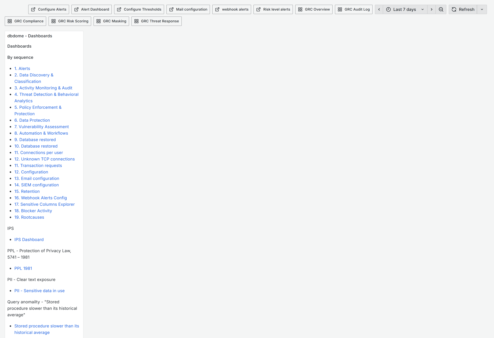

**SQL injection board** · `adm7hpj` — start here, then open the specific
technique.

Related, in the Security dashboard folder: **SQL Injection** (`adkb745`), showing
injection by pattern and prevention status.

### 10.2 Technique dashboards

| Dashboard | UID | Technique |
|---|---|---|
| **-Authentication Bypass** | `admk64d` | Bypassing login logic. **Treat as critical** — a hit implies authentication was defeated |
| **- Union based** | `adp58pz` | `UNION` appended to extract other tables. Indicates active data theft |
| **-Error based injection** | `ad4j4rm` | Extracting data through error messages |
| **- Boolean-based injections** | `adkk925` | Inferring data one true/false condition at a time |
| **- Time based** | `adnvqw5` | Inferring data from deliberate delays |
| **- Time based blind injection** | `adcqwvk` | Blind extraction via timing. Slow and persistent — look for volume |
| **- Stacked queries** | `adw44xx` | Extra statements appended after a terminator. **Permits writes, not just reads** |
| **- Comment based** | `adphgv5` | Comment syntax to truncate the original statement |
| **- tautology with comments** | `adk5ltv` | Always-true conditions plus comments — the classic `' OR '1'='1'--` |
| **- Information schema probing** | `adn2bdh` | Enumerating schema metadata. Usually reconnaissance preceding a real attempt |
| **-Encoding** | `adq45cm` | Encoded payloads evading pattern matching |
| **-order / Group by** | `adltjt8` | `ORDER BY` / `GROUP BY` probing to determine column counts. Early-stage reconnaissance |
| **-Shell function** | `ad47gg4` | Attempts to invoke OS-level functions. **The most serious of the set** — this is attempted host command execution, not data access |

### 10.3 Reading these dashboards

Escalate by intent, not count: reconnaissance techniques (information schema
probing, order/group by) precede extraction techniques (union, error, boolean,
time), which precede execution techniques (stacked queries, shell function). A
handful of shell-function attempts matters far more than hundreds of probes.

> **Verify the panel matches the dashboard before reporting from it.** Several of
> these dashboards carry a findings panel whose title names a *different*
> technique than the dashboard — see Appendix B. Until corrected, confirm the
> panel query on any dashboard you cite in a report.

---

## 11. Folder: `GRC` — governance, risk and compliance

Fourteen dashboards present on a full install. Where Sections 6–10 answer *what
is happening on the databases*, GRC answers *can we demonstrate control of it* —
these are the views for auditors, regulators and risk committees.

They read the same underlying data as the security dashboards, framed as
governance evidence rather than operational findings.

### 11.1 GRC Overview · `grc-overview` · 22 panels
The GRC landing page. *BLOCKED (24h)*, *ALERTED (24h)*, *Open Incidents*,
*High-Risk Users (≥70)*, *Active Blocked IPs*, *Active Masking Rules*, plus top
servers by event volume and firewall events by action.

**Start here** for a governance review, then drill into the specific dashboard.

### 11.2 GRC Compliance · `grc-compliance` · 12 panels
Events mapped to regulation: *PCI-DSS*, *HIPAA*, *GDPR*, *SOC2*, with events by
regulation over time, actions by regulation, breach events (BLOCKED / ALERTED)
and masking coverage by regulation.

**Use it to** answer "show me our PCI-relevant database events for the period".
That question is otherwise expensive to answer.

> The mapping is DBDOME's, not your auditor's. Confirm the rule-to-regulation
> mapping reflects your own scoping before presenting this as evidence.

### 11.3 GRC Risk Register · `grc-risk-register` · 13 panels
A formal risk register: *Open Risks*, *Critical/High (score ≥15)*, *In Treatment*,
*Avg Residual Risk Score*, with risks by inherent score, category and treatment
strategy, and top assets by residual risk.

Inherent vs residual is the point — residual is what remains after controls, and
it is the number a risk committee should be looking at.

### 11.4 GRC Risk Scoring · `grc-risk-scoring` · 11 panels
Per-user risk: *High-Risk Users (≥70)*, *Critical-Risk (≥90)*, average score,
monitored users, score trend, users by risk band, top 30 high-risk users.

> Risk scores are attached to named individuals. Treat this dashboard as
> personal data: restrict access, and confirm your lawful basis covers scoring
> employees before using it in any people process.

### 11.5 GRC Incident Lifecycle Management · `grc-incidents` · 14 panels
*Active Incidents*, *Critical Active*, **GDPR 72h Overdue**, *CAPA Actions Open*,
incidents per week by severity, by state, by category, and average resolution
time by severity.

**The GDPR 72-hour panel is the one to watch.** Article 33 gives 72 hours from
awareness to notify the supervisory authority. A non-zero count is a live
regulatory exposure, not a backlog item.

### 11.6 GRC Audit Log · `grc-audit-log` · 11 panels
*ALERTED*, *BLOCKED*, *MASKED* event counts, events per hour by action, top
source IPs and users among blocked events, and the audit event table.

The evidentiary record of what the platform did — as distinct from what it saw.

### 11.7 GRC Access Review · `grc-access-review` · 14 panels
Periodic access certification: *Open Review Instances*, **Overdue Reviews**,
*Completed (90d)*, *Active Cycles*, opened vs completed per month, and average
days to complete by cycle.

Overdue reviews are a classic audit finding. This is the dashboard that prevents
the finding rather than explaining it afterwards.

### 11.8 GRC Control Attestation Workflow · `grc-attestations` · 16 panels
*Pending Attestations*, *Exception Attestations*, *Open Periods*, *Completion
Rate (latest period)*, completions per month, status distribution, pending by
regulation.

Evidence that named owners affirmed their controls were operating — usually
required for SOC2 and ISO 27001.

### 11.9 GRC Cross-Border Transfer Tracking · `grc-cross-border` · 13 panels
*Transfers Detected (30d)*, **Without Legal Basis (30d)**, *Critical Risk
Transfers*, *Server Regions Configured*, transfers per day, mechanisms used, and
destinations by country.

> *Without Legal Basis* is the panel with regulatory teeth. Under GDPR Chapter V,
> transferring personal data outside the EEA without a valid mechanism (adequacy
> decision, SCCs, BCRs) is directly sanctionable. A non-zero figure needs same-day
> attention from Legal.

Accuracy depends entirely on *Server Regions Configured*. If servers have no
region assigned, this dashboard under-reports and its reassurance is false.

### 11.10 GRC Immutable Audit Hash Chain · `grc-hash-chain` · 11 panels
*Total Rows Hashed*, *Rows Pending Hash*, **Last Verification Result**,
*Verifications Run*, rows hashed per hour, and the last 30 verification results.

Tamper-evidence for the audit log: each row is chained to its predecessor, so
retrospective alteration breaks the chain.

> *Last Verification Result* is the only panel that matters for integrity. A
> failed verification means the audit log can no longer be relied upon as
> evidence, and is an incident in its own right. Check it before exporting audit
> data for any legal or regulatory purpose.

### 11.11 GRC Masking Coverage · `grc-masking` · 13 panels
*Active Masking Rules*, *Sensitive Columns (total)*, **Unmasked Sensitive
Columns**, *Token Vault Entries*, rules by mask type and PII type, active rules
by regulation, and the unmasked risk gap.

*Unmasked Sensitive Columns* is your exposure, stated plainly. It is the single
most useful number in the GRC folder.

### 11.12 GRC Policy Exceptions · `grc-policy-exceptions` · 15 panels
*Pending Approval*, *Active Approved Exceptions*, **Expiring in <7 Days**,
*Rejected (30d)*, requests per day, exceptions by status, regulation and server,
and top requestors.

Every exception is a control deliberately not applied. **Review *Top Requestors***
— one team generating most exceptions signals either a control that does not fit
reality or a team routing around it.

### 11.13 GRC Threat Response · `grc-threat-response` · 14 panels
*Response Success Rate (%)*, *Open Incidents*, *Blocked IPs (active)*, *Suspended
Users (active)*, responses in 24h, and automated responses per hour.

> This dashboard reports **automated enforcement that has already happened** —
> blocked addresses and suspended accounts. Review *Active Suspended Users*
> daily while automated response is armed; a wrongly suspended account is a
> production incident.

### 11.14 GRC Workflow Segregation of Duties · `grc-workflow-sod` · 12 panels
*SoD Violations (30d)*, *Violations This Week*, *Active SoD Rules*, *Unique
Violators (30d)*, violations per day, by action type, top violators, and the SoD
rule configuration.

SoD violations are among the highest-signal findings in the product: one person
completing a workflow that policy requires two people to complete.

---

## 12. Additional dashboards

Fifteen further dashboards present on a full install, outside the GRC folder.

### 12.1 Security features

| Dashboard | UID | What it shows |
|---|---|---|
| **App Login Guard** | `app-login-guard` | The applicative-login and program watchlists (`metrics.app_logins`, `metrics.programs`). Alerts when a watched login is used from a watched program. Managed through the Configure link, not by editing the tables |
| **Ransomware Guard** | `ransomware-guard` | *Open ransomware incidents*, *Alerts (24h)*, *Distinct servers (24h)*, and `SEC-SQL-AUD-031` alerts over 30 days. Detects several destructive operations in quick succession |
| **Excluded Logins - Self Activity** | `exclude-logins` | Logins excluded from alerting, toggled inline. **This is an exclusion register** — every row suppresses detection, so review it at the monthly control review |
| **Security Issues Explorer** | `sec-explorer` | Security hierarchy; click a root cause to filter its alerts. The fastest path from "what kind of problem" to "which alerts" |
| **IPS Dashboard - FortiAnalyzer** | `ips-fortianalyzer` | Intrusion data from FortiAnalyzer: severity, type, timeline, blocked vs monitored, top victims and attack sources. Network-layer context alongside the database findings |

> **Ransomware Guard and App Login Guard can both act**, not merely report.
> Confirm their dry-run state on *Webhook Alerts Configuration* (Section 8.8)
> before assuming they are observe-only.

### 12.2 Numbered operational views

| Dashboard | UID | What it shows |
|---|---|---|
| **10. Unknown TCP connections** | `ad9vz7j` | Connections from unrecognized sources — an early indicator of an unmanaged client |
| **11. Transaction requests** | `adwcncw` | Transaction request detail |
| **8. Database restored** | `adpk4gp`, `ad8fhr5` | Restore events. **Two dashboards share this title and UID-distinct definitions** — see Appendix B |

### 12.3 Alert report views

`alert_report` (`adlkvs5`), and four scenario-specific reports: `alert_report_Error_Based` (`adrxzq8`), `alert_report_Privilege_Escalation_Chain` (`adq45jb`), `alert_report_sensitive_schema` (`ad8fb9j`) and `alert_report_Stacked` (`adpxgwd`).

Report-formatted alert views for a specific attack pattern, intended for export
rather than live monitoring. `alert_report` includes a **node graph**, the only
one in the product — useful for showing an attack chain rather than a list.

**Recent alerts** (`adw26mh`) is a wide 16-panel summary spanning critical
issues, active threats, active users, cyber attacks and the supporting report
set.

---

## 13. Appendix A — Complete index

| # | Dashboard | UID | Folder | Panels |
|---|---|---|---|---|
| 1 | 1. Data Discovery & Classification | `addpcfp` | Security dashboard | — |
| 2 | 2. Activity Monitoring & Audit | `adbcsrw` | Security dashboard | 13 |
| 3 | 2. Schema DML Tracking | `adf9njw` | Security dashboard | 14 |
| 4 | 3. Threat Detection & Behavioral Analytics | `adccmtx` | Security dashboard | 22 |
| 5 | 4. Policy Enforcement & Protection | `adln6n5` | Security dashboard | 11 |
| 6 | 5. Data Protection | `ad88jgn` | Security dashboard | 13 |
| 7 | 6. Vulnerability Assessment | `adwb879` | Security dashboard | 12 |
| 8 | 7. Automation & Workflows | `adsddxs` | Security dashboard | 19 |
| 9 | 9. Connections per user | `ad2kf8w` | *(none)* | — |
| 10 | Alerts | `ad7kkx7` | Security dashboard | 17 |
| 11 | Anonymization | `secact-anon` | *(none)* | 12 |
| 12 | Audit expired | `adq5f5c` | Security dashboard | 13 |
| 13 | Blocker Activity | `adblkact` | Security dashboard | 11 |
| 14 | Blocking transactions | `adcrpzr` | Security dashboard | 12 |
| 15 | Blocks in databases | `adjwmbk` | Security dashboard | 13 |
| 16 | Configuration | `adnz9dq` | Security dashboard | 19 |
| 17 | Configuration | `dbdome-configuration` | Configuration | 33 |
| 18 | Connectivity | `adfbh29` | Security dashboard | 17 |
| 19 | Credentials stored in tables | `adsxwnr` | Security dashboard | 13 |
| 20 | Custom metrics | `ad7c5hm` | Security dashboard | 16 |
| 21 | Database connections per user | `admk4lj` | Security dashboard | 14 |
| 22 | Database restored | `adw9xck` | Security dashboard | 13 |
| 23 | dbdome nav | `adfrp7x` | Security dashboard | 2 |
| 24 | Dynamic Data Masking | `secact-ddm` | *(none)* | 12 |
| 25 | Email configuration | `adcdjsj` | Security dashboard | 7 |
| 26 | Enabled sysadmin | `adnskjz` | Security dashboard | 13 |
| 27 | Linked servers / DBLINKS - Hidden credentials | `adnb64w` | Security dashboard | 13 |
| 28 | Locked accounts | `ad8pvv6` | Security dashboard | 12 |
| 29 | Mail | `adxfxgr` | Security dashboard | 4 |
| 30 | main | `ad65k5x` | dbexpert.ai | 2 |
| 31 | New dashboard | `adtgq9l` | Security dashboard | 4 |
| 32 | Open Alerts | `advb58n` | Security dashboard | 14 |
| 33 | PII - Sensitive columns | `adw9lx6` | Security dashboard | 12 |
| 34 | PII - Sensitive data in use | `ad8885r` | Security dashboard | 12 |
| 35 | Policy not enforced | `ad99j9q` | Security dashboard | 12 |
| 36 | PPL - Protection of Privacy Law, 5741–1981 | `adlcctg` | Security dashboard | 17 |
| 37 | Processes | `advf7vg` | Security dashboard | 11 |
| 38 | RBAC - Role Based Access Control | `secact-rbac` | Security dashboard | 13 |
| 39 | Retention | `adretn001` | Security dashboard | 11 |
| 40 | Retention policy | `adc222t` | Security dashboard | 10 |
| 41 | risk level alerts | `ad54967` | Security dashboard | 7 |
| 42 | Rootcauses | `rootcauses` | Security dashboard | 5 |
| 43 | Same login active from multiple hosts | `adlvvwg` | Security dashboard | 5 |
| 44 | Scan jobs for leaks | `adm2ncg` | Security dashboard | 14 |
| 45 | Send report by mail | `ad9p6d2` | config | 8 |
| 46 | Sensitive Columns Explorer | `adpiicol` | Security dashboard | 15 |
| 47 | Sensitivity report | `adgp5hv` | Security dashboard | 11 |
| 48 | SIEM configuration | `adgtwcf` | Security dashboard | 9 |
| 49 | SQL Injection | `adkb745` | Security dashboard | 7 |
| 50 | SQL injection board | `adm7hpj` | SQL Injection dashboard | 7 |
| 51 | SQL injection - Boolean-based injections | `adkk925` | SQL Injection dashboard | 7 |
| 52 | SQL injection - Comment based | `adphgv5` | SQL Injection dashboard | 7 |
| 53 | SQL injection - Information schema probing | `adn2bdh` | SQL Injection dashboard | 7 |
| 54 | SQL injection - Stacked queries | `adw44xx` | SQL Injection dashboard | 7 |
| 55 | SQL injection - tautology with comments | `adk5ltv` | SQL Injection dashboard | 7 |
| 56 | SQL injection - Time based | `adnvqw5` | SQL Injection dashboard | 7 |
| 57 | SQL injection - Time based blind injection | `adcqwvk` | SQL Injection dashboard | 7 |
| 58 | SQL injection - Union based | `adp58pz` | SQL Injection dashboard | 7 |
| 59 | SQL injection -Authentication Bypass | `admk64d` | SQL Injection dashboard | 7 |
| 60 | SQL injection -Encoding | `adq45cm` | SQL Injection dashboard | 7 |
| 61 | SQL injection -Error based injection | `ad4j4rm` | SQL Injection dashboard | 7 |
| 62 | SQL injection -order / Group by | `adltjt8` | SQL Injection dashboard | 7 |
| 63 | SQL injection -Shell function | `ad47gg4` | SQL Injection dashboard | 7 |
| 64 | Static Data Masking | `secact-static` | *(none)* | 12 |
| 65 | Stored procedure slower than its average | `ad55bbz` | Security dashboard | 6 |
| 66 | Super users (sysadmin / sysDBA) | `adbzzdg` | Security dashboard | 11 |
| 67 | sysadmin accounts with weak password enforcement | `admz7fh` | Security dashboard | 13 |
| 68 | Take Action | `ad2w7wd` | Security dashboard | 15 |
| 69 | Tokenization | `secact-token` | *(none)* | 13 |
| 70 | Transaction report | `ad6lv7f` | Security dashboard | 16 |
| 71 | Vulnerability | `adf2766` | Security dashboard | 15 |
| 72 | webhook alerts | `ad9mll4` | Security dashboard | 5 |
| 73 | Webhook Alerts Configuration | `adwhcfg1` | Security dashboard | 7 |

### Additional dashboards on a full install (29)

| # | Dashboard | UID | Folder | Panels |
|---|---|---|---|---|
| 74 | GRC Overview | `grc-overview` | GRC | 22 |
| 75 | GRC Compliance | `grc-compliance` | GRC | 12 |
| 76 | GRC Risk Register | `grc-risk-register` | GRC | 13 |
| 77 | GRC Risk Scoring | `grc-risk-scoring` | GRC | 11 |
| 78 | GRC Incident Lifecycle Management | `grc-incidents` | GRC | 14 |
| 79 | GRC Audit Log | `grc-audit-log` | GRC | 11 |
| 80 | GRC Access Review | `grc-access-review` | GRC | 14 |
| 81 | GRC Control Attestation Workflow | `grc-attestations` | GRC | 16 |
| 82 | GRC Cross-Border Transfer Tracking | `grc-cross-border` | GRC | 13 |
| 83 | GRC Immutable Audit Hash Chain | `grc-hash-chain` | GRC | 11 |
| 84 | GRC Masking Coverage | `grc-masking` | GRC | 13 |
| 85 | GRC Policy Exceptions | `grc-policy-exceptions` | GRC | 15 |
| 86 | GRC Threat Response | `grc-threat-response` | GRC | 14 |
| 87 | GRC Workflow Segregation of Duties | `grc-workflow-sod` | GRC | 12 |
| 88 | App Login Guard | `app-login-guard` | *(none)* | 4 |
| 89 | Ransomware Guard | `ransomware-guard` | *(none)* | 8 |
| 90 | Excluded Logins - Self Activity | `exclude-logins` | *(none)* | 3 |
| 91 | Security Issues Explorer | `sec-explorer` | *(none)* | 5 |
| 92 | IPS Dashboard - FortiAnalyzer | `ips-fortianalyzer` | *(none)* | 16 |
| 93 | 10. Unknown TCP connections | `ad9vz7j` | *(none)* | 4 |
| 94 | 11. Transaction requests | `adwcncw` | *(none)* | 5 |
| 95 | 8. Database restored | `adpk4gp` | *(none)* | 4 |
| 96 | 8. Database restored | `ad8fhr5` | *(none)* | — |
| 97 | alert_report | `adlkvs5` | *(none)* | 5 |
| 98 | alert_report_Error_Based | `adrxzq8` | *(none)* | — |
| 99 | alert_report_Privilege_Escalation_Chain | `adq45jb` | *(none)* | — |
| 100 | alert_report_sensitive_schema | `ad8fb9j` | *(none)* | — |
| 101 | alert_report_Stacked | `adpxgwd` | *(none)* | — |
| 102 | Recent alerts | `adw26mh` | *(none)* | 16 |

---

## 14. Appendix B — Observations from this review

Recorded while cataloguing the deployed dashboards. None prevents use of the
platform; the first is the one that affects the correctness of reports.

### B.1 SQL injection panel titles do not match their dashboards

Several technique dashboards carry a findings panel naming a **different**
technique:

| Dashboard | Panel title found |
|---|---|
| SQL injection - Boolean-based injections | *comment based injections* |
| SQL injection - tautology with comments | *comment based injections* |
| SQL injection - Time based | *Stacked query injections* |

Consistent with dashboards cloned from a template where the panel was not
retitled. **Whether the underlying query was also left unchanged determines
whether these dashboards display the wrong findings.** Verify each panel's query
before citing these dashboards in a report or an audit.

### B.2 Two dashboards share the name "Configuration"
`dbdome-configuration` (estate-wide, 33 panels) and `adnz9dq` (server-centric,
19 panels). Users cannot tell them apart from a search result. Suggest renaming
to *Platform Configuration* and *Server Configuration*.

### B.3 Overlapping connections dashboards
*9. Connections per user* (`ad2kf8w`) and *Database connections per user*
(`admk4lj`) cover the same ground. The former sits outside any folder and is
numbered inconsistently with the 1–7 programme series. Consider consolidating.

### B.4 Five dashboards sit outside any folder
*9. Connections per user*, Anonymization, Dynamic Data Masking, Static Data
Masking, Tokenization. The four data-protection action dashboards are the most
consequential in the product and are the hardest to find. Suggest a *Data
Protection* folder.

### B.5 Placeholder content
*New dashboard* (`adtgq9l`) is an unrenamed placeholder. *main* (`ad65k5x`) — the
landing page — contains a panel titled *New panel*. Both are visible to customers.

### B.6 Character-encoding corruption
Two dashboards contain mojibake where a non-ASCII character was written in the
wrong encoding:

* *PPL- Protection of Privacy Law, 5741 **â** 1981* — should be an en dash (–)
* Retention: *Apply retention edit (auto-runs on **â²/â¼** click)* — should be ▲/▼

Cosmetic, but on a compliance dashboard named after a statute it looks careless.

### B.7 Spelling
*Blcked* (should be *Blocked*) appears on three dashboards: PII - Sensitive
columns, PII - Sensitive data in use, and PPL.

### B.9 Two different dashboard sets are in the field
The reference development install carries **73** dashboards; a full customer
install carries **102**. The 29-dashboard difference is not a minor increment —
it includes the entire GRC capability (risk register, compliance mapping,
incident lifecycle, attestation, cross-border transfers, audit hash chain) plus
Ransomware Guard, App Login Guard and the FortiAnalyzer IPS view.

Anyone demonstrating or supporting DBDOME from a base install is working without
the compliance story. Worth deciding whether the GRC folder should ship by
default rather than as a provisioning option.

### B.10 Duplicate and unlabelled dashboards on the full install
* **"8. Database restored" exists twice** (`adpk4gp` and `ad8fhr5`) with distinct
  UIDs. One is presumably superseded; both are visible to users.
* The numbered series is inconsistent — a *"Database restored"* numbered **8**,
  *"Unknown TCP connections"* numbered **10**, *"Transaction requests"* numbered
  **11**, and *"Connections per user"* numbered **9**, none of which belong to
  the 1–7 programme series they appear to extend.
* **Twenty dashboards sit outside any folder** on the full install, including
  Ransomware Guard, App Login Guard and Security Issues Explorer — three of the
  most operationally useful views in the product.

### B.11 Grafana requires authentication on the customer install
The reference install answers the Grafana API anonymously; the customer install
requires a login. That is the correct posture for the customer install — but it
means **the reference install is exposing dashboards without authentication**,
which is worth closing.

### B.8 Panel counts differ between installs
*1. Data Discovery & Classification* carries **28 panels** on the full install.
It did not return a definition on the reference install during this review, and
*9. Connections per user* (`ad2kf8w`) did not return one on either.

More generally, a dashboard of the same UID is not guaranteed to have the same
panels on every install. Where this guide states a panel count, it reflects the
system it was generated against; treat counts as indicative rather than
contractual.

### B.8a Original note (superseded)
*1. Data Discovery & Classification* (`addpcfp`) and *9. Connections per user*
(`ad2kf8w`) did not return their JSON during this review. Their entries here are
based on role and title rather than verified panel inventory. Worth confirming
they render correctly for users.

---

## 15. Support

| | |
|---|---|
| Technical support | support@dbexpert.ai |

---

*Copyright (c) 2026 DBEXPERT. All rights reserved. DBDOME is a trademark of
DBEXPERT. Grafana is a trademark of Grafana Labs, redistributed unmodified under
AGPL-3.0; see THIRD_PARTY_NOTICES.txt.*
